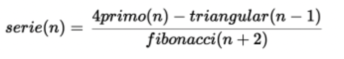

# Sequence calculator

Esta aplicación esta realizada en React junto con Vite y su proposito es calcular la siguiente operación:



## Pasos para correr la app

  1. Clonar el repositorio usando:
  ```
  git clone https://github.com/CesarRORC09/singular_test.git
  ```


  2. Una vez clonado el proyecto correr el siguiente comando para instalar las dependencias:

  ```
    npm install
  ```

  3. Para correr el proyecto usar el siguiente comando:
  ```
    npm run dev
  ```

  4. Para correr las pruebas usal el siguiente comando:
  ```
    npm run test
  ```

